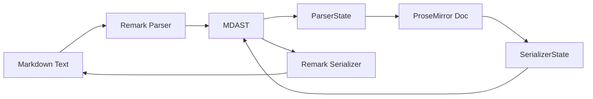

Fylepad uses a bidirectional Markdown parser built on the Remark ecosystem to convert between TipTap's ProseMirror document structure and standard Markdown syntax.

## Architecture overview

The parser has three main components:



1. **Remark processor** — Parses and serializes Markdown
2. **ParserState** — Converts MDAST to ProseMirror
3. **SerializerState** — Converts ProseMirror to MDAST

## Markdown extension

The core Markdown extension is defined in `extensions/markdown/index.ts`:

```typescript
import { Extension } from "@tiptap/core";
import { unified } from "unified";
import remarkParse from "remark-parse";
import remarkStringify from "remark-stringify";
import remarkGfm from "remark-gfm";
import remarkDirective from "remark-directive";
import { ParserState } from "./parser/state";
import { SerializerState } from "./serializer/state";

export const Markdown = Extension.create({
  name: "markdown",
  
  addStorage() {
    return {
      processor: unified()
        .use(remarkParse)
        .use(remarkStringify)
        .use(remarkGfm)
        .use(remarkDirective),
      
      parse: (markdown: string) => {
        return new ParserState(this.editor, this.storage.processor)
          .parse(markdown);
      },
      
      serialize: (document: Node) => {
        return new SerializerState(this.editor, this.storage.processor)
          .serialize(document);
      },
      
      get: () => {
        return this.storage.serialize(this.editor.state.doc);
      },
      
      set: (markdown: string, emit?: boolean) => {
        const doc = this.storage.parse(markdown);
        const tr = this.editor.state.tr;
        this.editor.view.dispatch(
          tr.replaceWith(0, tr.doc.content.size, doc)
            .setMeta("preventUpdate", !emit)
        );
      },
    };
  },
});
```

### Unified processor

The processor uses these Remark plugins:

- **remark-parse** — Parses Markdown to MDAST
- **remark-stringify** — Serializes MDAST to Markdown
- **remark-gfm** — GitHub Flavored Markdown (tables, task lists, strikethrough)
- **remark-directive** — Custom directives for Mermaid, PlantUML, etc.

## Parser state

The `ParserState` class converts MDAST (Markdown Abstract Syntax Tree) to ProseMirror nodes:

```typescript
// extensions/markdown/parser/state.ts
import { Node as ProseMirrorNode } from "@tiptap/pm/model";
import { Processor } from "unified";

export class ParserState {
  editor: Editor;
  processor: Processor;
  stack: StackItem[];
  
  constructor(editor, processor) {
    this.editor = editor;
    this.processor = processor;
    this.stack = [];
  }
  
  parse(markdown: string): ProseMirrorNode {
    // Parse Markdown to MDAST
    const tree = this.processor.parse(markdown);
    const ast = this.processor.runSync(tree);
    
    // Convert MDAST to ProseMirror
    this.openNode(this.editor.schema.nodes.doc);
    this.processNode(ast);
    this.closeNode();
    
    return this.stack[0].node;
  }
  
  processNode(node: MarkdownNode) {
    // Check if any extension handles this node
    for (const ext of this.extensions) {
      if (ext.markdown?.parser?.match(node)) {
        ext.markdown.parser.apply(this, node, type);
        return;
      }
    }
    
    // Default processing
    this.defaultProcess(node);
  }
}
```

### Node matching

Each TipTap extension can register a parser:

```typescript
// Example from Mermaid node
addStorage() {
  return {
    markdown: {
      parser: {
        match: node => 
          node.type === "containerDirective" && 
          node.name === "mermaid",
        apply: (state, node, type) => {
          const code = collectText(node);
          state.openNode(type).addText(code).closeNode();
        },
      },
    },
  };
}
```

### Stack-based parsing

The parser uses a stack to build the document:

```typescript
class StackItem {
  type: NodeType;
  content: ProseMirrorNode[];
  attrs: Record<string, any>;
}

openNode(type: NodeType, attrs = {}) {
  this.stack.push({ type, content: [], attrs });
}

addText(text: string) {
  const top = this.stack[this.stack.length - 1];
  top.content.push(this.editor.schema.text(text));
}

closeNode() {
  const item = this.stack.pop();
  const node = item.type.create(item.attrs, item.content);
  
  if (this.stack.length > 0) {
    this.stack[this.stack.length - 1].content.push(node);
  }
  
  return node;
}
```

## Serializer state

The `SerializerState` class converts ProseMirror nodes to MDAST:

```typescript
// extensions/markdown/serializer/state.ts
import { Node as ProseMirrorNode } from "@tiptap/pm/model";
import { Processor } from "unified";

export class SerializerState {
  editor: Editor;
  processor: Processor;
  ast: MarkdownNode[];
  
  constructor(editor, processor) {
    this.editor = editor;
    this.processor = processor;
    this.ast = [];
  }
  
  serialize(document: ProseMirrorNode): string {
    // Convert ProseMirror to MDAST
    this.processNode(document);
    
    // Serialize MDAST to Markdown
    const tree = { type: "root", children: this.ast };
    return this.processor.stringify(tree);
  }
  
  processNode(node: ProseMirrorNode) {
    // Check if any extension handles this node
    for (const ext of this.extensions) {
      if (ext.markdown?.serializer?.match(node)) {
        ext.markdown.serializer.apply(this, node);
        return;
      }
    }
    
    // Default processing
    this.defaultProcess(node);
  }
}
```

### Node serialization

Extensions register serializers:

```typescript
// Example from Mermaid node
addStorage() {
  return {
    markdown: {
      serializer: {
        match: node => node.type.name === "mermaid",
        apply: (state, node) => {
          state.openNode({
            type: "containerDirective",
            name: "mermaid",
          });
          state.next(node.content);
          state.closeNode();
        },
      },
    },
  };
}
```

## Custom directives

Fylepad uses `remark-directive` for custom content:

### Mermaid diagrams

```markdown
:::mermaid
graph TD
  A --> B
:::
```

Parses to:

```json
{
  "type": "containerDirective",
  "name": "mermaid",
  "children": [
    { "type": "text", "value": "graph TD\n  A --> B" }
  ]
}
```

### PlantUML diagrams

```markdown
:::plantuml
@startuml
Alice -> Bob
@enduml
:::
```

Parses to:

```json
{
  "type": "containerDirective",
  "name": "plantuml",
  "children": [
    { "type": "text", "value": "@startuml\nAlice -> Bob\n@enduml" }
  ]
}
```

## GitHub Flavored Markdown

The `remark-gfm` plugin adds:

### Tables

```markdown
| Column 1 | Column 2 |
|----------|----------|
| Data 1   | Data 2   |
```

### Task lists

```markdown
- [ ] Todo
- [x] Done
```

### Strikethrough

```markdown
~~deleted~~
```

### Autolinks

```markdown
https://github.com/imrofayel/fylepad
```

## Usage in the app

### Import Markdown

```typescript
// Example from components/editor.vue
const importMarkdown = async () => {
  const file = await selectFile();
  const markdown = await file.text();
  
  // Set editor content from Markdown
  editor.storage.markdown.set(markdown);
};
```

### Export Markdown

```typescript
const exportMarkdown = () => {
  // Get Markdown from editor
  const markdown = editor.storage.markdown.get();
  
  // Download as .md file
  downloadFile(markdown, `${tab.title}.md`, "text/markdown");
};
```

### Auto-save

Markdown is also used for persistence:

```typescript
// Serialize to Markdown for storage
const saveState = () => {
  const markdown = editor.storage.markdown.get();
  localStorage.setItem("tab-content", markdown);
};

// Restore from Markdown
const restoreState = () => {
  const markdown = localStorage.getItem("tab-content");
  if (markdown) {
    editor.storage.markdown.set(markdown, false);
  }
};
```

## Extension hooks

Extensions can modify the processor:

```typescript
addStorage() {
  return {
    markdown: {
      hooks: {
        beforeInit: (processor) => {
          // Add remark plugins before initialization
          return processor.use(remarkMath);
        },
        afterInit: (processor) => {
          // Modify after initialization
          return processor;
        },
      },
    },
  };
}
```

## Next steps

<CardGroup cols={2}>
  <Card title="Custom nodes" icon="cube" href="/development/custom-nodes">
    Learn about custom node implementations
  </Card>
  <Card title="TipTap extensions" icon="puzzle-piece" href="/development/tiptap-extensions">
    Overview of TipTap extensions
  </Card>
</CardGroup>