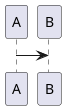

Fylepad supports exporting notes to PDF and Markdown formats, plus importing Markdown files from other editors.

## Exporting notes

### Export as PDF

Create print-ready PDF documents from your notes:

<Steps>
  <Step title="Open export menu">
    Click the export button in the toolbar
  </Step>
  <Step title="Choose PDF">
    Select **Export as PDF** or **Print** from the menu
  </Step>
  <Step title="Print dialog">
    Your browser's print dialog opens with a preview
  </Step>
  <Step title="Save or print">
    Save as PDF or send to a printer
  </Step>
</Steps>

<Note>
PDF export uses your browser's print functionality, which means you can customize margins, paper size, and other print settings.
</Note>

### What's included in PDF exports

Fylepad's PDF export preserves:

✅ **All formatting** — Bold, italic, underline, colors, fonts  
✅ **Headings** — All six heading levels with proper sizing  
✅ **Lists** — Bullet lists, numbered lists, and task lists  
✅ **Code blocks** — Syntax highlighted with background styling  
✅ **Blockquotes** — With left border styling  
✅ **Tables** — Full table structure (rendered as HTML)  
✅ **Inline code** — With background styling  
✅ **Highlights** — Background colors preserved  
✅ **Links** — Clickable hyperlinks  

<Warning>
Mermaid diagrams, PlantUML diagrams, and mathematical equations may not render perfectly in PDF exports. Consider taking screenshots of these elements if precise rendering is critical.
</Warning>

### PDF styling

The PDF export applies professional styling:

```css
/* PDF uses these styles */
font-family: Inter, sans-serif;
max-width: 800px;
font-size: 18px;
line-height: 1.6;
```

Code blocks use:
- Roboto Mono font
- Gray background (#f4f4f4)
- Orange left border (#f36d33)

## Export as Markdown

Save your notes as standard Markdown files:

<Steps>
  <Step title="Open export menu">
    Click the export button in the toolbar
  </Step>
  <Step title="Select Markdown">
    Choose **Export as Markdown**
  </Step>
  <Step title="Download file">
    A `.md` file downloads with your tab's title as the filename
  </Step>
</Steps>

### Markdown export format

Fylepad exports clean, compatible Markdown:

<Tabs>
  <Tab title="Text formatting">
    ```markdown
    **bold**
    *italic*
    ~~strikethrough~~
    `inline code`
    ```
  </Tab>
  <Tab title="Headings">
    ```markdown
    # Heading 1
    ## Heading 2
    ### Heading 3
    ```
  </Tab>
  <Tab title="Lists">
    ```markdown
    - Bullet item
    - Another item
    
    1. Numbered item
    2. Another item
    
    - [ ] Task item
    - [x] Completed task
    ```
  </Tab>
  <Tab title="Code blocks">
    ````markdown
    ```javascript
    console.log("Hello");
    ```
    ````
  </Tab>
</Tabs>

### Special content in Markdown exports

**Diagrams:**
````markdown



````

**Math equations:**
```markdown
Inline: $E = mc^2$

Block:
$$
\int_0^\infty e^{-x^2} dx = \frac{\sqrt{\pi}}{2}
$$
```

**Tables:**
```markdown
| Column 1 | Column 2 |
|----------|----------|
| Data 1   | Data 2   |
```

<Info>
Markdown exports use GitHub Flavored Markdown (GFM) syntax, ensuring compatibility with GitHub, GitLab, Obsidian, Notion, and other Markdown editors.
</Info>

## Importing notes

### Import Markdown files

Bring existing Markdown files into Fylepad:

<Steps>
  <Step title="Open import menu">
    Click the import button in the toolbar (paperclip icon)
  </Step>
  <Step title="Select file">
    Choose a `.md` or `.txt` file from your computer
  </Step>
  <Step title="File opens in new tab">
    Fylepad creates a new tab with your imported content
  </Step>
  <Step title="Continue editing">
    The content is now editable like any other note
  </Step>
</Steps>

### Supported import formats

Fylepad can import:

- **Markdown files** (`.md`, `.markdown`)
- **Plain text files** (`.txt`)
- **Files with Markdown content** (any text-based format)

### What happens during import

<Tabs>
  <Tab title="Standard Markdown">
    Fylepad parses standard Markdown syntax:
    - Headings, lists, emphasis
    - Code blocks, blockquotes
    - Links and images
    - Tables (GFM)
  </Tab>
  <Tab title="Extended syntax">
    Advanced features are also supported:
    - Task lists `- [ ]`
    - Strikethrough `~~text~~`
    - Mermaid diagrams
    - PlantUML diagrams
    - Math equations (LaTeX)
  </Tab>
  <Tab title="Plain text">
    Plain text files import as-is:
    - No parsing applied
    - Content appears exactly as in the file
    - You can then apply formatting in Fylepad
  </Tab>
</Tabs>

<Note>
Imported files are copied into Fylepad. Changes you make won't affect the original file unless you export again.
</Note>

## File compatibility

### Editors that work well with Fylepad

Fylepad's Markdown is compatible with:

- **GitHub** — READMEs, issues, pull requests
- **GitLab** — Documentation, wikis
- **Obsidian** — Note-taking and knowledge base
- **Notion** — Import/export via Markdown
- **VS Code** — With Markdown preview extensions
- **Typora** — WYSIWYG Markdown editor
- **Bear** — macOS/iOS note app
- **Joplin** — Open-source note app
- **Zettlr** — Academic writing app

### Limitations

<Warning>
Some proprietary features may not transfer between editors:

- **Custom syntax** — Editor-specific Markdown extensions
- **Metadata** — YAML frontmatter may not import
- **Embeds** — File attachments, PDFs, images may not transfer
- **Plugins** — Obsidian plugins or Notion databases won't work
</Warning>

## Batch operations

### Exporting multiple notes

To export multiple notes:

<Steps>
  <Step title="Switch to each tab">
    Navigate to the tab you want to export
  </Step>
  <Step title="Export individually">
    Use the export function for each note
  </Step>
  <Step title="Organize files">
    Collect exported `.md` files in a folder
  </Step>
</Steps>

<Tip>
Name your tabs descriptively before exporting. The tab title becomes the filename, making it easier to organize exported notes.
</Tip>

### Importing multiple files

Import notes one at a time:

1. Import the first file
2. A new tab is created
3. Import the next file
4. Repeat for all files

Each file creates its own tab.

## Use cases

<CardGroup cols={2}>
  <Card title="Backup" icon="floppy-disk">
    Export all notes as Markdown to create a backup archive
  </Card>
  <Card title="Sharing" icon="share-nodes">
    Export to PDF to share formatted notes with others
  </Card>
  <Card title="Migration" icon="right-left">
    Import Markdown files from other note apps
  </Card>
  <Card title="Publishing" icon="upload">
    Export Markdown to publish on GitHub, blogs, or wikis
  </Card>
</CardGroup>

## Next steps

<CardGroup cols={2}>
  <Card title="Markdown support" icon="markdown" href="/features/markdown-support">
    Learn about Markdown syntax in Fylepad
  </Card>
  <Card title="Auto-save" icon="floppy-disk" href="/features/auto-save">
    Understand how your notes are saved automatically
  </Card>
</CardGroup>