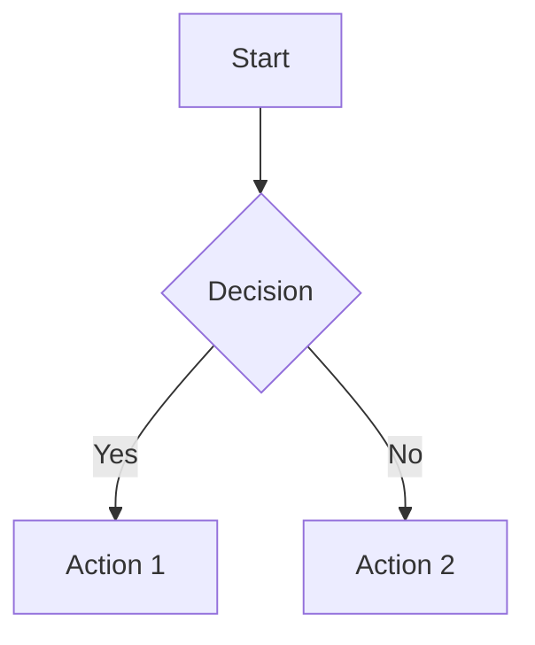
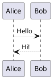

Fylepad features comprehensive Markdown support powered by TipTap Markdown and Remark. You can write notes using standard Markdown syntax, and the editor will render them beautifully in real-time.

## How it works

Fylepad uses a bidirectional Markdown parser:

- **Write in Markdown** — Type Markdown syntax and see it render instantly
- **Export to Markdown** — Your notes are converted to clean `.md` files
- **Import Markdown** — Drop `.md` files into Fylepad and continue editing

The parser is built on the `remark` ecosystem with support for GitHub Flavored Markdown (GFM).

## Supported Markdown syntax

### Headings

```markdown
# Heading 1
## Heading 2
### Heading 3
#### Heading 4
##### Heading 5
###### Heading 6
```

### Emphasis

```markdown
**bold text**
*italic text*
***bold and italic***
~~strikethrough~~
```

### Lists

<Tabs>
  <Tab title="Unordered">
    ```markdown
    - Item 1
    - Item 2
      - Nested item
    - Item 3
    ```
  </Tab>
  <Tab title="Ordered">
    ```markdown
    1. First
    2. Second
    3. Third
    ```
  </Tab>
  <Tab title="Task lists">
    ```markdown
    - [ ] Todo item
    - [x] Completed item
    ```
  </Tab>
</Tabs>

### Links and images

```markdown
[Link text](https://example.com)

```

### Code

<Tabs>
  <Tab title="Inline code">
    ```markdown
    Use `backticks` for inline code
    ```
  </Tab>
  <Tab title="Code blocks">
    ````markdown
    ```javascript
    const greeting = "Hello, world!";
    console.log(greeting);
    ```
    ````
  </Tab>
</Tabs>

### Blockquotes

```markdown
> This is a blockquote
> Multiple lines supported
```

### Horizontal rules

```markdown
---
```

### Tables

```markdown
| Column 1 | Column 2 | Column 3 |
|----------|----------|----------|
| Data 1   | Data 2   | Data 3   |
| Data 4   | Data 5   | Data 6   |
```

## GitHub Flavored Markdown (GFM)

Fylepad supports GFM extensions:

### Autolinks

URLs are automatically converted to clickable links:

```markdown
https://github.com/imrofayel/fylepad
```

### Strikethrough

```markdown
~~deleted text~~
```

### Tables

Full GFM table syntax with alignment:

```markdown
| Left aligned | Center aligned | Right aligned |
|:-------------|:--------------:|--------------:|
| Left         | Center         | Right         |
```

### Task lists

```markdown
- [x] Completed task
- [ ] Pending task
```

## Custom Markdown extensions

### Mathematical expressions

Write LaTeX math inline or in blocks:

```markdown
Inline: $E = mc^2$

Block:
$$
\int_{-\infty}^{\infty} e^{-x^2} dx = \sqrt{\pi}
$$
```

### Mermaid diagrams

Create diagrams with Mermaid syntax:

````markdown

````

### PlantUML diagrams

Use PlantUML for UML diagrams:

````markdown

````

## Markdown shortcuts

Fylepad includes helpful Markdown shortcuts:

| Type | Result |
|------|--------|
| `#` + space | Heading 1 |
| `##` + space | Heading 2 |
| `-` + space | Bullet list |
| `1.` + space | Numbered list |
| `[]` + space | Task list |
| ` ``` ` | Code block |
| `>` + space | Blockquote |
| `---` | Horizontal rule |

<Tip>
You can type Markdown syntax directly, and Fylepad will convert it to formatted text as you type.
</Tip>

## Export and import

### Export to Markdown

Export your notes as clean `.md` files:

<Steps>
  <Step title="Open export menu">
    Click the export button in the toolbar or press the keyboard shortcut
  </Step>
  <Step title="Choose Markdown format">
    Select **Export as Markdown** from the menu
  </Step>
  <Step title="Save file">
    Choose a location and save your `.md` file
  </Step>
</Steps>

### Import Markdown files

Bring existing Markdown files into Fylepad:

<Steps>
  <Step title="Open import menu">
    Click the import button or use the keyboard shortcut
  </Step>
  <Step title="Select file">
    Choose a `.md` file from your computer
  </Step>
  <Step title="Start editing">
    Your Markdown file opens in a new tab, ready to edit
  </Step>
</Steps>

<Note>
Fylepad preserves your Markdown formatting during import and export, ensuring compatibility with other Markdown editors.
</Note>

## Parser implementation

Fylepad uses the following Markdown parsing stack:

- **tiptap-markdown** — Bidirectional TipTap ↔ Markdown conversion
- **remark** — Markdown processing framework
- **remark-gfm** — GitHub Flavored Markdown support
- **remark-math** — LaTeX math notation support
- **remark-directive** — Custom directive support

This ensures accurate parsing and rendering of complex Markdown documents.

## Next steps

<CardGroup cols={2}>
  <Card title="Code blocks" icon="code" href="/advanced/code-blocks">
    Syntax highlighting for 100+ languages
  </Card>
  <Card title="Diagrams" icon="diagram-project" href="/advanced/diagrams">
    Create Mermaid and PlantUML diagrams
  </Card>
</CardGroup>